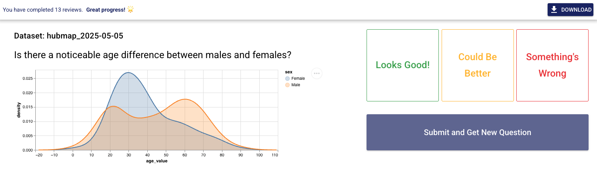

# DQVis Dataset Review Tool

This repository provides an interactive interface for reviewing and validating examples in the [DQVis](https://huggingface.co/datasets/HIDIVE/DQVis) dataset.

📂 **Dataset on Hugging Face**: [HIDIVE/DQVis](https://huggingface.co/datasets/HIDIVE/DQVis)  
🛠️ **Data generation code**: [hms-dbmi/DQVis-Generation](https://github.com/hms-dbmi/DQVis-Generation)

---

The tool has two different modes. The **reviewer mode** provides a simple interface for reviewers to rate sampled dataset points in the dataset. The **admin mode** provides additional information for debuggin. This can be toggled with the `adminMode` variable in `MainLayout.vue`

### Reviewer Mode



### Admin Mode


---

## 📋 Review Instructions

See the [review instructions](docs/review_instructions.md) for details on how to conduct a review and submit feedback.

## 🛠️ Developer Setup

To run the tool locally as a developer, follow these steps:

## Build from Source

1. git clone

```bash
git clone https://github.com/hms-dbmi/udi-dataset-review
cd udi-dataset-review
```

2.  **Install dependencies**

```bash
yarn
```

3. add the sqlite database file to `.quasar/dev-electron/` folder.

4. **Run the code editor with Quasar in development mode.**

```bash
quasar dev -m electron
```
